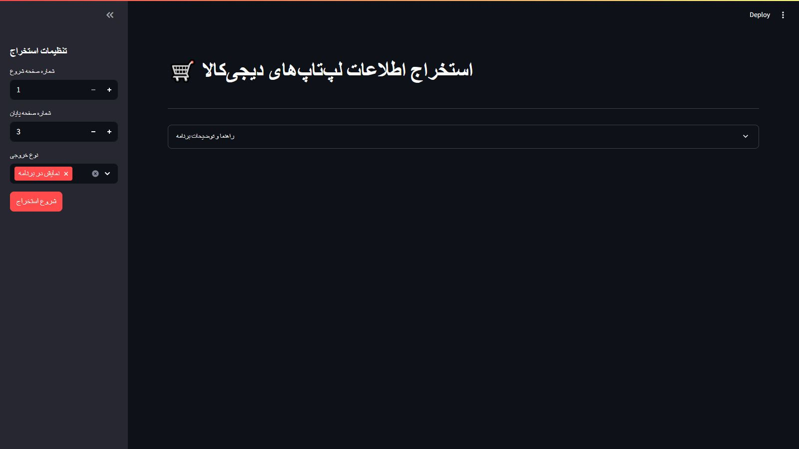

### Unified README.md (English & Persian)
```markdown
# 🖥️ Digikala Laptop Scraper / استخراج لپ‌تاپ از دیجی‌کالا



## 🌍 English Documentation

### ✨ Features
- **Smart Browser Management**
  - Auto-updates Edge browser
  - Dynamic WebDriver installation
- **Anti-Detection Technology**
  - Headless mode support
  - Randomized user fingerprints
- **Data Processing**
  - Scrape 1-40 pages of results
  - Excel export with download button

### 🚀 Quick Start
```bash
# Install dependencies
pip install selenium streamlit openpyxl pandas psutil requests

# Launch application
streamlit run project_1.py
```

### 🧠 Core Components
| File | Purpose |
|------|---------|
| `project_1.py` | Main application logic |
| `selenium_setting.py` | Browser automation |
| `kill_browser.py` | Process management |

---

## 📚 فارسی / Persian Documentation

### ✨ ویژگی‌ها
- **مدیریت هوشمند مرورگر**
  - بروزرسانی خودکار Edge
  - نصب خودکار WebDriver
- **فناوری ضد تشخیص**
  - حالت Headless
  - اثرانگشت تصادفی کاربر
- **پردازش داده**
  - استخراج ۱-۴۰ صفحه نتایج
  - خروجی اکسل با دکمه دانلود

### 🚀 راه‌اندازی سریع
```bash
# نصب پیش‌نیازها
pip install selenium streamlit openpyxl pandas psutil requests

# اجرای برنامه
streamlit run project_1.py
```

### 🧠 اجزای اصلی
| فایل | توضیحات |
|------|---------|
| `project_1.py` | منطق اصلی برنامه |
| `selenium_setting.py` | اتوماسیون مرورگر |
| `kill_browser.py` | مدیریت فرآیندها |

---

## 📁 File Structure
```
📦 project
├── 📜 project_1.py
├── 📜 selenium_setting.py
├── 📜 kill_browser.py
├── 📂 webdrivers
├── 📷 screenshot.png
└── 📜 README.md
```

